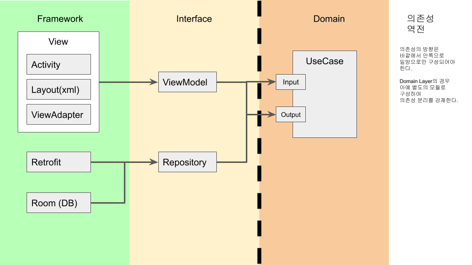

# Android-MvvmSample

Android MVVM sample app using Databinding, AAC, RxJava, Navigation Component.

# Features

- 랜덤 찾기 : 무작위로 멤버를 찾아주는 기능
- 검색 기능 : 멤버 목록을 전체를 조회하고 키워드로 검색하는 기능
- 추가 기능 : 새로운 멤버를 목록에 추가하는 기능

# Structure

## MVVM 

MVVM 아키텍처 패턴을 사용하여 화면에 대한 로직을 

### MVVM - Model 

- 도메인 로직을 별도의 모듈로 분리하여 안드로이드 또는 프레임워크 의존성을 강제로 분리한다.

- 도메인 로직은 UseCase 패턴을 이용하며 UseCase는 재활용해선 안된다.

- 로직을 ViewModel에서의 처리를 최소화하고 UseCase에서 최대한 처리하도록 한다.

- RxJava를 이용하여 UseCase 에서 데이터를 바로 반환할 필요 없이, Observable 을 넘겨서 ViewModel 또는 View 에서 실제로 사용할 시점에 subscribe() 하도록 유예할 수 있다.

## Data Binding

- 데이터 바인딩 + LiveData를 활용하여 Activity, Fragment에서 뷰를 처리하기 위한 코드를 최소화 한다.

## Context Dependent Logic

- 일부 Context를 반드시 필요로하는 view 로직은 LiveData로 감싼 Event를 던져서 View에서 처리하도록 한다.

- View에서 처리하는 한이 있더라도 DataBindingAdapter 를 최대한 활용하여 보일러 플레이트를 최소화 한다.

